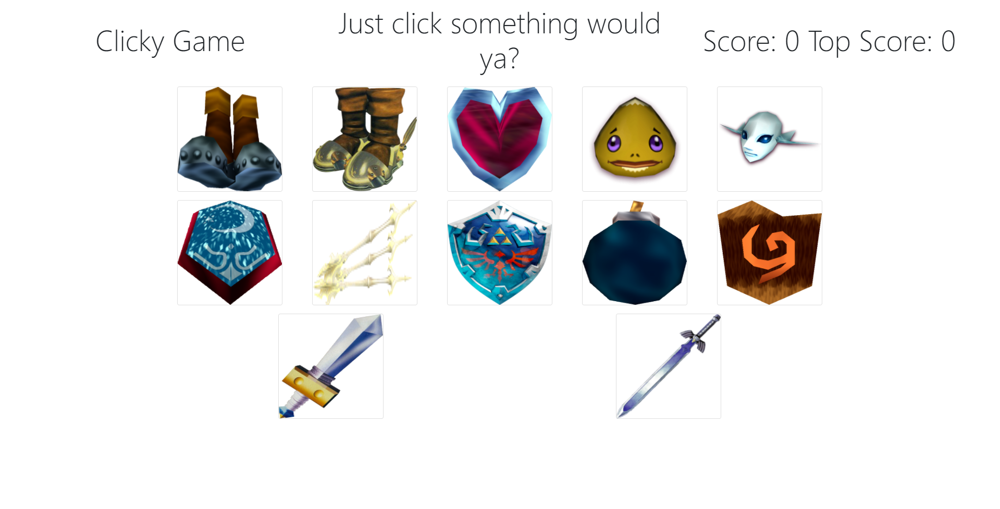

# clicky-game

This clicky game is a React application utilizing client side code to allow the user to play a game with shuffling images and a score/high score. Start by clicking an image and try not to click the same image twice! Your high score is the amount of consecutive pictures clicked before clicking the same picture again.

## Getting Started

I started by creating a static HTML file of the base layout of the site. Then I downloaded a bunch of images from the net and put them in a folder in my public directory. After that I pieced my code into components and instantiated React.

### Prerequisites
I had to create a new React app and create a JSON file of all of my images and their respective names and IDs

### Solving
I began to solve by creating a base index file that imports content and renders it to the page. Then I made another file that actually calls for the components and other functions. I had to make the App file import all the proper files and then I began writing the functions. Firstly I knew that I needed a function that would shuffle the items and one that would handle image clicks. Then I instantiated state and began to fill out each function and the ways it would alter the state.

## Technologies Used

* [JavaScript](https://www.javascript.com/)
* [React](https://reactjs.org/)

## Screenshot 

;

## Authors
* **Thomas Peeler** 

## Github Repository
- [https://github.com/TMPeeler/clicky-game]